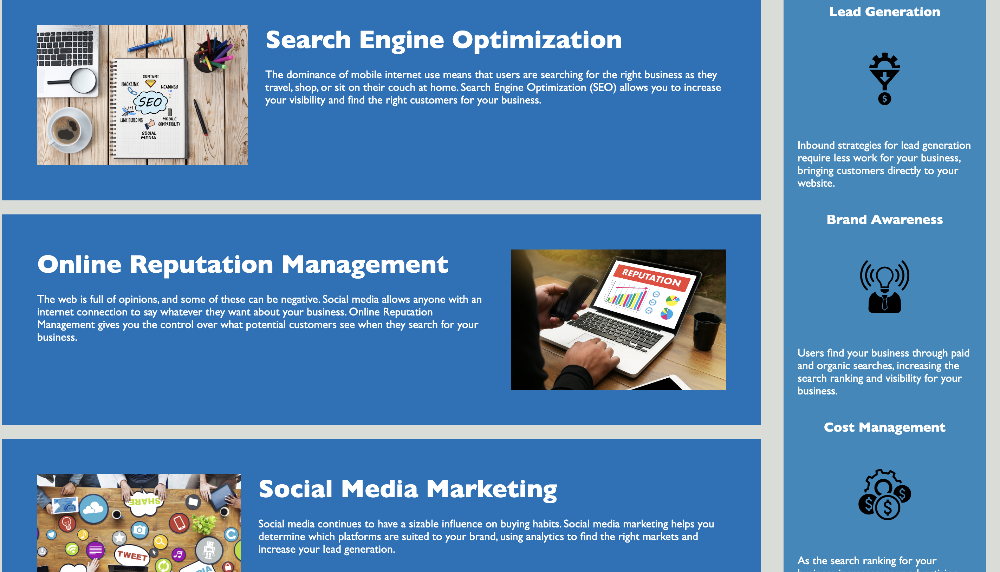
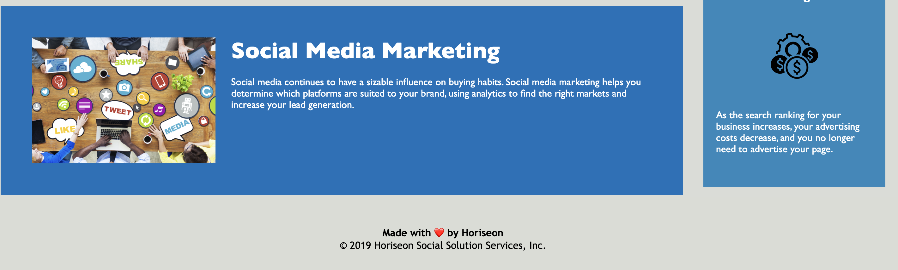

# HTML CSS Git Challenge: Code Refactor
In this, Challenge is an on-the-job ticket, which means starter code that we need to modify. This week's Challenge involves a very important aspect of web development: accessibility.

In this Challenge, a marketing agency has hired me to refactor an existing site to make it more accessible.

# Project Requirements:
  * User Story:
    * AS A marketing agency
    * I WANT a codebase that follows accessibility standards
    * SO THAT our own site is optimized for search engines

  * Acceptance Criteria: I can achieve this completing the following:
    * Semantic HTML elements can be found throughout the source code.
    * HTML elements follow a logical structure independent of styling and positioning.
    * Image and icon elements contain accessible alt attributes.
    * Heading attributes fall in sequential order.
    * Title elements contain a concise, descriptive title.

# Description of this Project:
  *  Semantic HTML elements can be found throughout the source code.
      * I used W3School website for this project for more understanding about semantic elements. I     understanstand semantic elements like: header, nav, main, aside section, footer and more. Then I used these elements in this challenge.

  *  HTML elements follow a logical structure independent of styling and positioning.
      * I used W3School for this project for more understanding about styling. Then I tried a logical structure independent of styling and positioning.

  *  Image and icon elements contain accessible alt attributes.
      * I made more descriptive alt attribute to explain more about images.

  *  Heading attributes fall in sequential order.
      * I checked all heading tag they should be in sequential order.

  *  Title elements contain a concise, descriptive title.
      * I made my project title unique, descriptive and concise.       

     I have taken help from different online platforms to understand Semantic Tags and try to use them throughout this website to make it more understandable. And I also added alt attributes to understand missing elements incase something went wrong with the website or any browser fail to render images.

# Technologies Used:
  * HTML
  * CSS
  * Online learning Tool(W3School)

# Image Links of this Project:
  

  

  

# Video Link of this Project:
  

# Application GitHub URL:
https://github.com/khnfarha1987/html-code-refactor-with-css

# Application Deployed live URL:
https://khnfarha1987.github.io/html-code-refactor-with-css/

